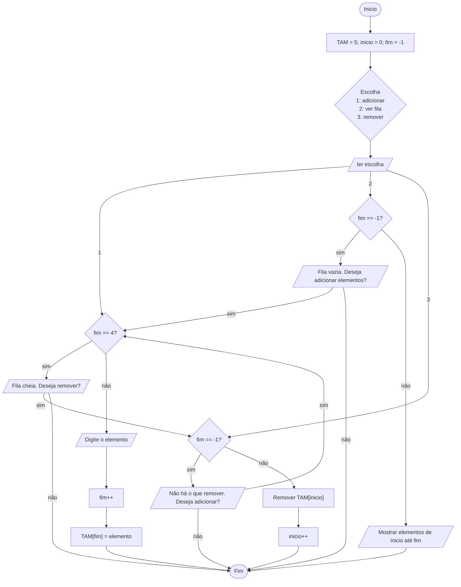

```mermaid
flowchart TD

A([Inicio]) --> B[TAM = 5; inicio = 0; fim = -1]

B --> C{Escolha
1: adicionar
2: ver fila
3: remover}

C --> D[/ler escolha/]

D -->|1| E{fim == 4?}
D -->|2| F{fim == -1?}
D -->|3| G{fim == -1?}

%% ADICIONAR
E -->|sim| H[/Fila cheia. Deseja remover?/]
E -->|não| Y[/Digite o elemento/]

H -->|sim| G
H -->|não| Z([Fim])

Y --> I[fim++]
I --> J["TAM[fim] = elemento"]
J --> Z

%% VER FILA
F -->|sim| K[/Fila vazia. Deseja adicionar elementos?/]
F -->|não| L[/Mostrar elementos de inicio até fim/]

K -->|sim| E
K -->|não| Z

L --> Z

%% REMOVER
G -->|sim| M[/Não há o que remover. Deseja adicionar?/]
G -->|não| N["Remover TAM[inicio]"]

M -->|sim| E
M -->|não| Z

N --> O[inicio++]
O --> Z
```