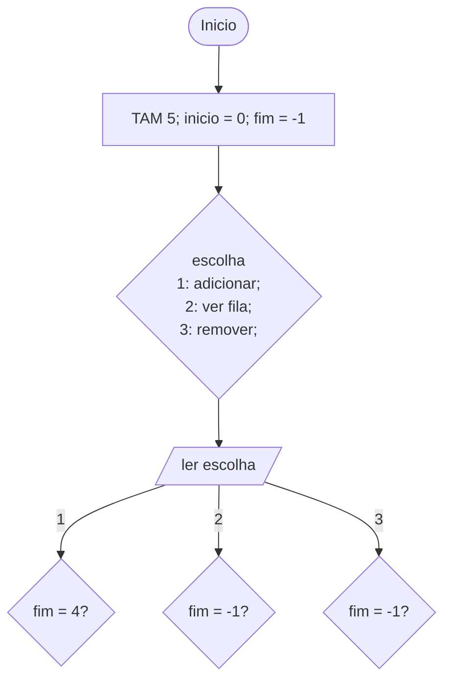

```mermaid
flowchart TD

A([Inicio]) --> B[TAM 5; inicio = 0; fim = -1]

B --> c{escolha
1: adicionar;
2: ver fila;
3: remover;} 

c --> d[/ler escolha/]

d-->|1| e{fim = 4?}
d-->|2| f{fim = -1?}
d-->|3| g{fim = -1?}
```