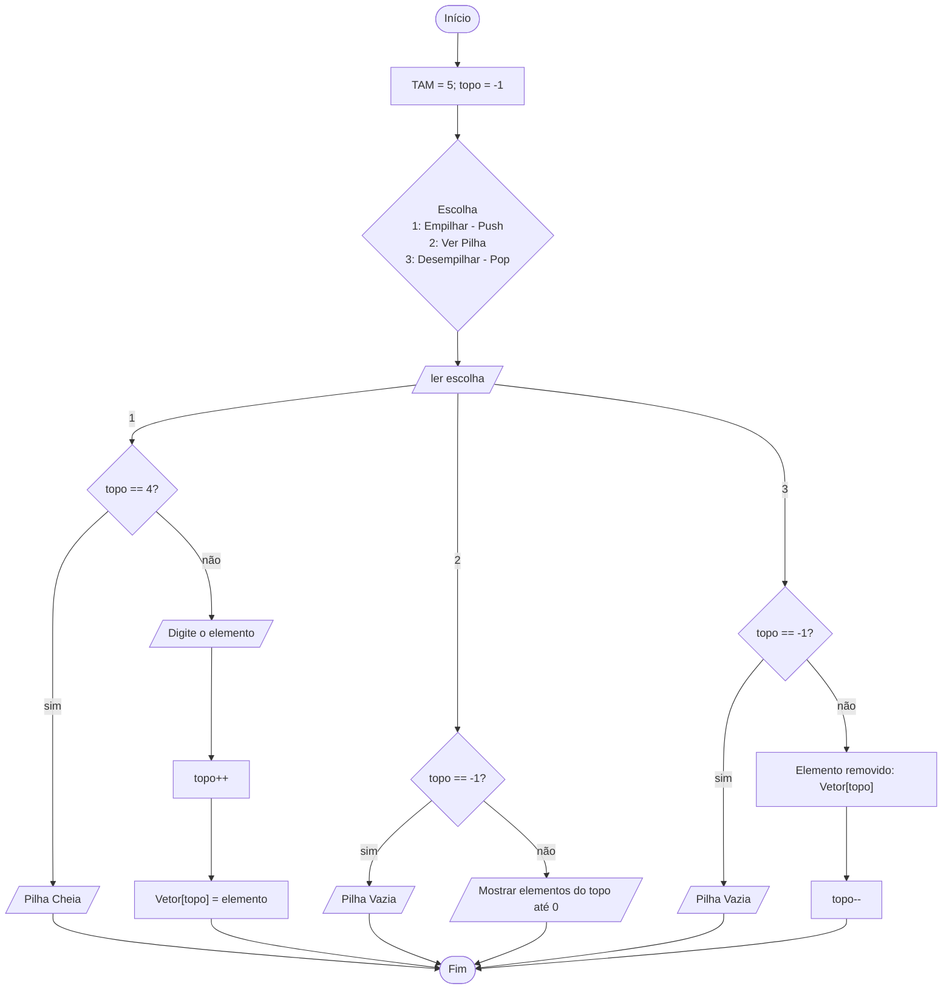

```mermaid
flowchart TD

A([Início]) --> B[TAM = 5; topo = -1]

B --> C{Escolha
1: Empilhar - Push
2: Ver Pilha
3: Desempilhar - Pop}

C --> D[/ler escolha/]

D -->|1| E{topo == 4?}
D -->|2| F{topo == -1?}
D -->|3| G{topo == -1?}

%% ADICIONAR (PUSH)
E -->|sim| H[/Pilha Cheia/]
E -->|não| Y[/Digite o elemento/]

H --> Z([Fim])

Y --> I[topo++]
I --> J["Vetor[topo] = elemento"]
J --> Z

%% VER PILHA
F -->|sim| K[/Pilha Vazia/]
F -->|não| L[/Mostrar elementos do topo até 0/]

K --> Z
L --> Z

%% REMOVER (POP)
G -->|sim| M[/Pilha Vazia/]
G -->|não| N["Elemento removido: Vetor[topo]"]

M --> Z
N --> O[topo--]
O --> Z
```