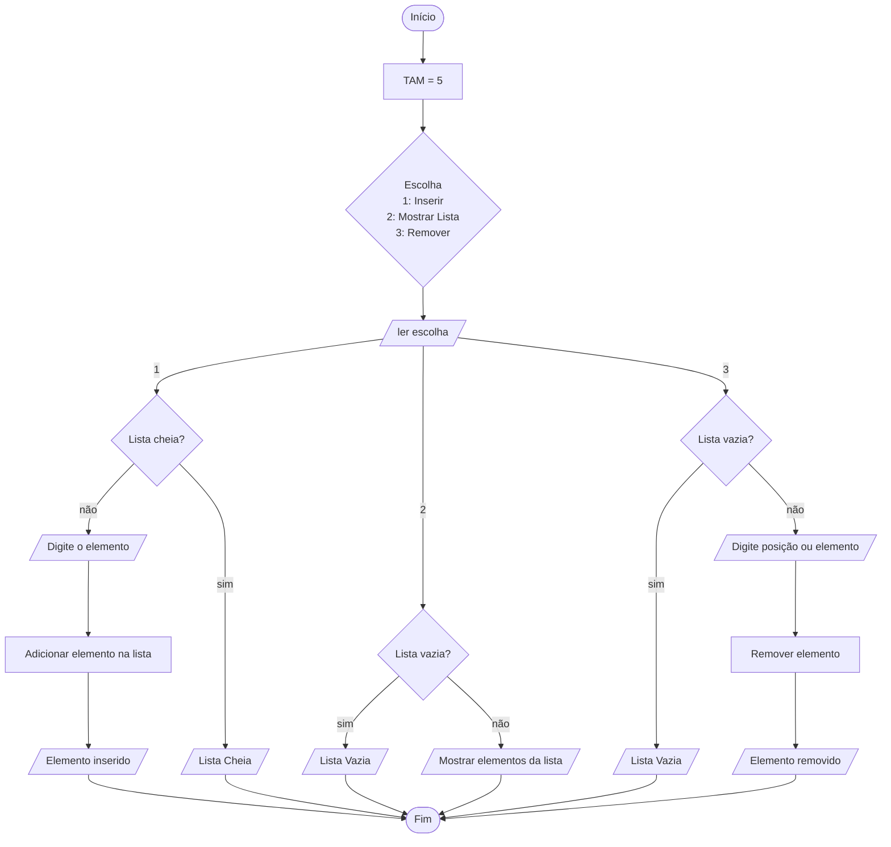

```mermaid
flowchart TD

A([Início]) --> B[TAM = 5]

B --> C{Escolha
1: Inserir
2: Mostrar Lista
3: Remover}

C --> D[/ler escolha/]

D -->|1| E{Lista cheia?}
D -->|2| F{Lista vazia?}
D -->|3| G{Lista vazia?}

%% INSERIR
E -->|sim| H[/Lista Cheia/]
E -->|não| I[/Digite o elemento/]

I --> J[Adicionar elemento na lista]
J --> K[/Elemento inserido/]
K --> Z([Fim])

H --> Z

%% MOSTRAR
F -->|sim| L[/Lista Vazia/]
F -->|não| M[/Mostrar elementos da lista/]

L --> Z
M --> Z

%% REMOVER
G -->|sim| N[/Lista Vazia/]
G -->|não| O[/Digite posição ou elemento/]

O --> P[Remover elemento]
P --> Q[/Elemento removido/]

N --> Z
Q --> Z
```